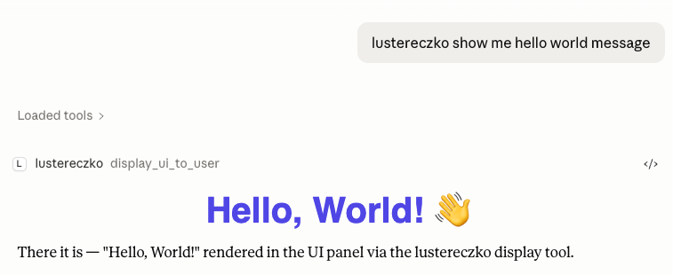
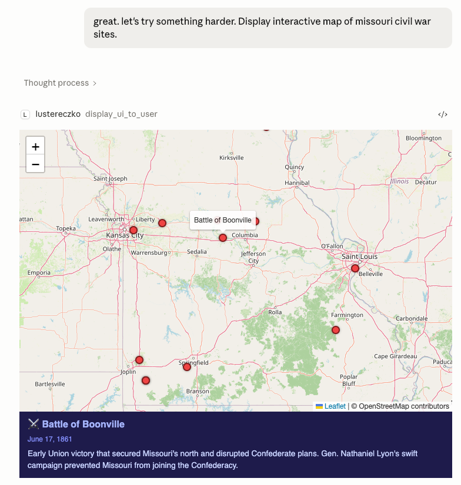
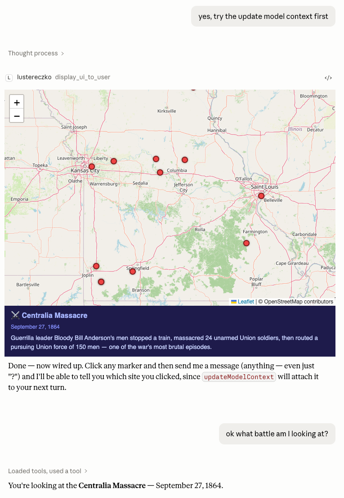
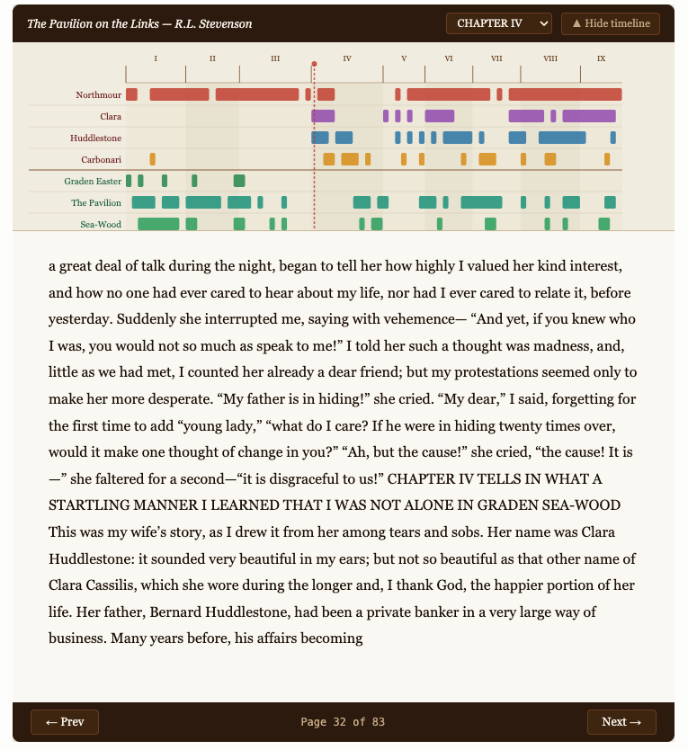

## Lustereczko
Dynamic UI for your generative agent. Your LLM can use it to display HTML interactive UI to the user. 

This seems modest, and you can use it for modest things like charting data you are currently looking at. But it is also a proof of concept for something much bigger. That your agent can write you an app right in the chat. The only app you will ever need. And it will be customized to your unique way of doing things, and it will change with you.

## Examples

But let's start small...

**Hello World** — simplest possible display call:

**Interactive map** — LLM generates a full Leaflet map with 12 Civil War battle markers:

**Bidirectional context** — user clicks a marker, `window.app.updateModelContext()` feeds the selection back to the LLM, which then answers questions about it:

It doesn't have to end here. With dynamic tool deployment, you can ask the agent to build you a full blown app — here is an example of an enriched book experience that you can get with one of the recipe skills.

## Installation
Do we really need this? This is a python mcp server, your agent should be able to figure out how to install it locally. While at it, pick up the lustereczko-recipies skill.

> **Claude Desktop (Cowork mode) users:** see [docs/cowork-setup.md](docs/cowork-setup.md) for a step-by-step guide, including compatibility notes — MCP App UI does not work in Claude Code mode or the VS Code CC extension.

## Example prompts
- "Display Civil War battles in Missouri on an interactive map. Pay attention to the battle I select." - will use window.updateModelContext

## How it works
MCP App extension to the MCP protocol allows MCP server to display the UI to the user. Lustereczko takes a UI that user's LLM has generated and reflects it back to the host. We also allow the user's agent to deploy dynamic tools to the server that the UI can then call, thus building full frontend / backend apps. There is server log introspection, ui debugging instrumentation and dynamic skill system to allow the agent to fix most issues on its own.

Why it can't work: security blah blah... Also, LLMs have a hard time with frameworks like REACT.

Why it works: we keep it local and restrict the js libraries. LLMs handle HTMX generated UIs just fine, so we stick to that. Interaction with LLMs does not require complicated UIs, so we can keep it simple.

## What is this name
Your LLM knows, so ask it...